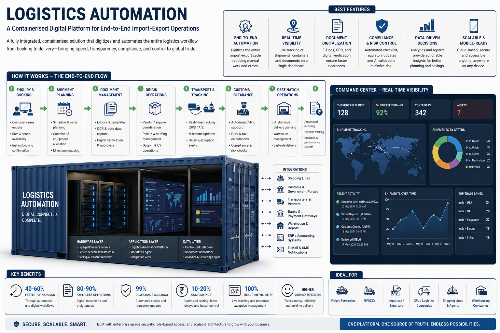

# 🌐 LogisticsAUTO

An industry-grade, AI-powered system designed to automate the digitization, parsing, and risk assessment of logistics documents for international trade.



## 🎯 Project Overview
This platform provides a fully integrated, containerized solution that digitizes and automates the entire logistics workflow—from booking to delivery—bringing speed, transparency, compliance, and control to global trade.

### 🚀 Key Benefits
- **40-60% Faster Turnaround**: Through automation and digital workflows.
- **80-90% Paperless Operations**: Digital documents and e-signatures.
- **99% Compliance Accuracy**: Automated checks and regulatory updates.
- **10-20% Cost Savings**: Optimized routing, fewer delays, and better control.
- **100% Real-time Visibility**: Live tracking and proactive exception management.

---

## 🏗️ Technical Architecture (Dockerized)

The system is built on a production-ready, decoupled architecture using **Docker Compose** to orchestrate five primary services.

### 🧠 Backend (The Core Engine)
The backend is a high-performance Python ecosystem designed for heavy-duty document processing.
- **FastAPI**: Serves as the primary REST API layer, handling file uploads and status polling with sub-millisecond latency.
- **PostgreSQL 15**: A robust relational database that ensures ACID compliance for all transaction records, audit ledgers, and document metadata.
- **Redis 7**: Acts as a high-speed message broker, facilitating communication between the API and the background workers.
- **Celery Worker**: A dedicated service that handles CPU-intensive tasks (OCR, NLP, ML) asynchronously, preventing the main API from blocking.
- **Pydantic v2**: Ensures strict data validation and type safety across the entire pipeline.
- **SQLAlchemy 2.0**: A powerful ORM that manages database migrations and complex relational queries.

### 🎨 Frontend (Command Center)
A premium, responsive dashboard for real-time visibility and operations.
- **React 18 & Vite**: Optimized for speed and a smooth developer experience.
- **Tailwind CSS v4**: Features a sleek glassmorphic design with a custom color palette for a professional enterprise feel.
- **Real-time Synchronization**: Implements intelligent polling to update document status without page refreshes.

### 🤖 AI & Machine Learning Pipeline
- **Google Gemini 2.5 Flash**: Orchestrates structured NLP parsing to extract precise fields (Invoice #, Dates, Amounts, HS Codes) from raw text.
- **EasyOCR**: Provides a local, high-speed OCR layer for initial text extraction from images/PDFs.
- **Isolation Forest (Scikit-Learn)**: A production-ready anomaly detection model that calculates a fraud/risk score for every transaction based on historical data patterns.

---

## 🔄 The End-to-End Flow

1.  **Enquiry & Booking**: User initiates a shipment or document upload.
2.  **Shipment Planning**: System prepares the metadata and container allocation.
3.  **Document Management**: 
    *   File is uploaded to the `/data/uploads` volume.
    *   A task is dispatched to **Redis**.
4.  **Origin Operations (Background)**:
    *   **Celery Worker** picks up the task.
    *   **OCR** extracts raw text.
    *   **Gemini AI** structured extraction parses the text into JSON.
    *   **ML Model** assesses risk and flags anomalies.
5.  **Customs Clearance & Validation**: Extracted goods are mapped to HS Codes for regulatory compliance.
6.  **Destination Operations**: Parsed data is committed to **PostgreSQL**, and the frontend is notified via polling.

---

## 🛠️ Deployment Guide

### Prerequisites
- [Docker Desktop](https://www.docker.com/products/docker-desktop/)
- [Google Gemini API Key](https://aistudio.google.com/app/apikey)

### Quick Start
1.  **Environment Setup**:
    ```bash
    cp .env.example .env
    # Edit .env and add your GEMINI_API_KEY
    ```

2.  **Launch Cluster**:
    ```bash
    docker-compose up --build -d
    ```

3.  **Access Points**:
    - **Dashboard**: `http://localhost:5173`
    - **API Docs**: `http://localhost:8000/docs`

---

*Developed by adar-shh04*
